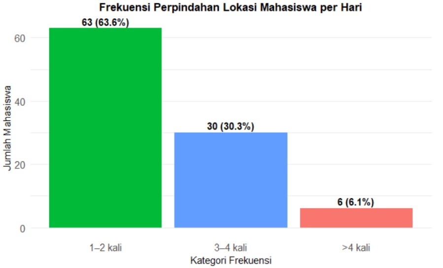
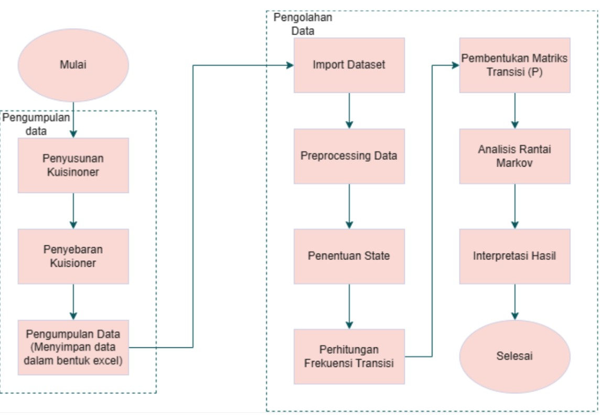
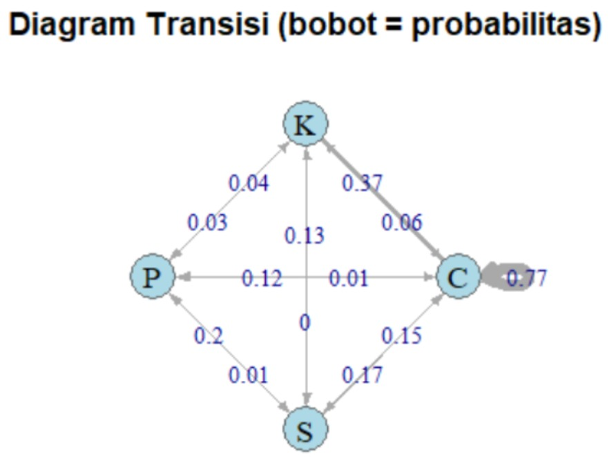

# Analisis Mobilitas Mahasiswa Menggunakan Rantai Markov

Repositori ini berisi analisis pola mobilitas harian mahasiswa Sains Data angkatan 2022 menggunakan **Model Rantai Markov (Markov Chain)** untuk memodelkan probabilitas perpindahan antar empat state lokasi utama di kampus: **Kelas (C), Kantin (K), Perpustakaan (P), dan Kosan (S)**.

Penelitian ini menggunakan dataset hasil kuesioner aktivitas mahasiswa per-jam pada rentang waktu **07.00–17.00 WIB selama lima hari kerja**, kemudian dilakukan penyusunan **Matriks Probabilitas Transisi**, perhitungan **Probabilitas Multi-Langkah (P², P³, P¹⁰)**, serta penentuan **Distribusi Stasioner (Steady-State Distribution)**.

---


## 📝 Pendahuluan

Mobilitas mahasiswa merupakan bentuk aktivitas perpindahan antar lokasi kampus berdasarkan kebutuhan akademik, sosial, dan personal. Model **Rantai Markov** digunakan untuk memodelkan pola perpindahan probabilistik berdasarkan kondisi saat ini tanpa mempertimbangkan kondisi sebelumnya (*memoryless property*).
Tujuan penelitian ini adalah:

* Mengetahui pola transisi antar lokasi mahasiswa
* Menyusun matriks probabilitas transisi
* Menghitung distribusi steady-state jangka panjang
* Memvisualisasikan pola mobilitas mahasiswa berdasarkan data empiris

---

## Struktur Repository

```
Markov-Mobilitas-Mahasiswa-ITERA-2025
│
├── README.md
├── Laporan Kelompok 9-RA.pdf
│
├── Data
│ └── raw_data.csv
│
├── R
│ └── Rantai Markov.RMD
│
├── Gambar
│ ├── diagram_alir.jpg
│ ├── transition_graph.jpg
│ └── plot_frekuensi.jpg
│
└── Output
├── matrix_transisi.jpg
├── distribusi_stasioner.jpg
├── hasil_P2.jpg
├── hasil_P3.jpg
└── hasil_P10.jpg
```

---

## Dataset

Data yang digunakan berupa hasil kuesioner aktivitas mahasiswa per-jam, direpresentasikan dalam empat state:

| Kode | Lokasi       |
| ---- | ------------ |
| C    | Kelas        |
| K    | Kantin       |
| P    | Perpustakaan |
| S    | Kosan        |

Total Observasi: **5.445 data posisi (99 mahasiswa × 55 waktu observasi)**

Berikut distribusi observasi per state:



---

## Metodologi Analisis

Proses analisis dilakukan dengan tahapan berikut:



* Penyusunan matriks transisi (N)
* Konversi ke matriks probabilitas transisi (P)
* Probabilitas multi-langkah (P², P³, P¹⁰)
* Distribusi stasioner (Eigenvector)
* Visualisasi graf transisi menggunakan edge weight

---

## Tools & Library

| Tools/Library | Fungsi              |
| ------------- | ----------------------------- |
| RStudio       | Analisis dan komputasi Markov |
| expm          | Perhitungan Pⁿ                |
| igraph        | Diagram transisi              |
| dplyr         | Manipulasi data               |

---

## Cara Menjalankan Script R

```R
source("R/Rantai Markov.RMD")
```

Pastikan package berikut sudah terinstall:

```R
install.packages(c("dplyr", "stringr", "igraph", "expm"))
```
---

## Hasil dan Visualisasi Model Markov
### Graf Transisi Probabilitas
Visualisasi hubungan perpindahan antar state setiap satu langkah:



### Steady State Distribution
Hasil perhitungan distribusi stasioner menunjukkan probabilitas jangka panjang:
| State | Probabilitas |
|--------|------------|
| Kelas | 45.83% |
| Kosan | 45.27% |
| Kantin | 5.93% |
| Perpustakaan | 2.96% |

**Mahasiswa paling banyak berada di Kelas dan Kosan sebagai dua pusat aktivitas utama.**

---

## Anggota Kelompok

* **Ganiya Syazwa – 122450073**
* **Chalifia Wananda – 122450076**
* **Alvia Asrinda Br Ginting – 122450077**
* **Renisha Putri Giani – 122450079**

---


